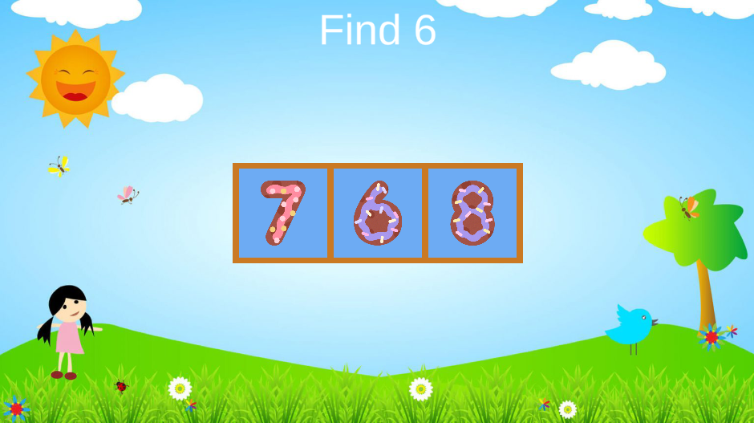

#Тестовое задание на основе детской игры "найди что-либо"
Цель игры: выбрать правильный вариант ответа, соответствующий заданию.
<h3>Игровой процесс по шагам:</h1>
● В игре присутствует 3 уровня сложности. Легкий - 3 ячейки. Средний - 6 ячеек.
Сложный - 9 ячеек.

● При завершении Легкого уровня игрок переходит на средний, а затем на
сложный.

● При запуске сцены:
- Через bounce эффект появляются ячейки с объектами (с
цифрами/буквами);
- Через fade in эффект появляется UI текст с заданием, выбрать
правильный вариант ответа;

● При тапе на неправильный ответ:
- Объект внутри карточки дергается туда-сюда (easeInBounce)

● При тапе на правильный ответ:
- bounce объекта внутри карточки
- Появляются партиклы звездочки

● При окончании всех уровней:
- В центре экрана появляется кнопка Restart, нажав на нее можно начать
игру заново с легкого уровня.
- Все элементы в игре не должны быть кликабельным.
- Должно эффектом FadeIn/FadeOut появиться затемнение экрана, но она
не должна перекрывать кнопку Restart.

● При нажатии кнопки Restart:
- Должен через эффект FadeIn/FadeOut появиться загрузочный экран
(можно просто белой/черной текстурой), игровые объекты удалятся и
появятся новые, после этого загрузочный экран пропадает.
- Все должно начинаться с пункта “При запуске сцены”.

<h3>Условия генерации данных</h1>

● При смене уровня
- Цель задания (правильный ответ) выбирается случайным образом. Она
не повторяется в рамках сессии, где сессия - запущенный Play Mode. Т.е.
если в задании говорится найти цифру 4, то на следующих уровнях
цифра 4 не выберется
- эффект появления ячеек НЕ происходит. Старые объекты в ячейках
удаляются, появляются новые (мгновенно. Новые ячейки также
появляются мгновенно).
- мгновенно меняется текст задания в UI. Пример: Find F или Find 7
- Важное требование. При смене уровня может подставится один из двух
видов визуализаций (из разных наборов данных): вариант с цифрами,
либо с буквами, соответственно и цель задания меняется вместе с
набором объектов. Данная конфигурация должна быть максимально
простой и понятной. Это необходимо для того, чтобы в дальнейшем без
участия разработчика можно было в данную игру подставить фрукты,
овощи, виды машин и пр.

● Во время генерации уровня учитывать, что правильный вариант ответа только
один.

● В коде не должно быть разделения на букву/цифру. Механика должна работать
с любыми объектами, вне зависимости от того что это. Код одинаковый для
обоих случаев, различаются только наборы данных и визуальная
составляющая. В общем виде будет выглядеть так: есть набор цифр от 1 до 9
включительно и есть набор букв от A до Z. Первым делом выбирается состав
данных, который как минимум включает в себя необходимый набор объектов в
ячейках и цель задания.

● Префаб ячейки должен быть единственным в проекте

● Gameplay не должен разделяться на разные сцены, все должно работать на
одной сцене.

Скриншоты сделаны в рамках одной игровой сессии. Дизайн подобран в соответствии с примером тестового задания

    
    
1 уровень сложности

    
    
2 уровень сложности

    
    
3 уровень сложности

